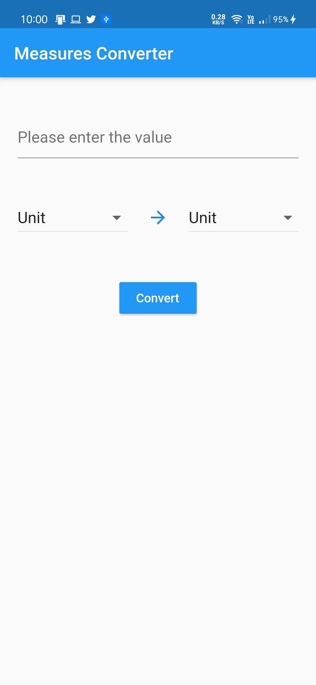
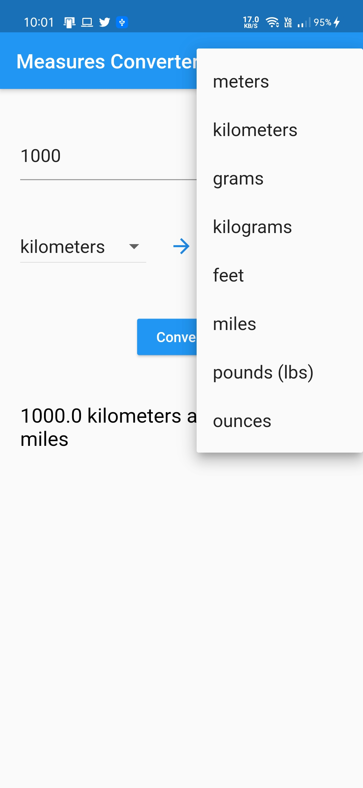
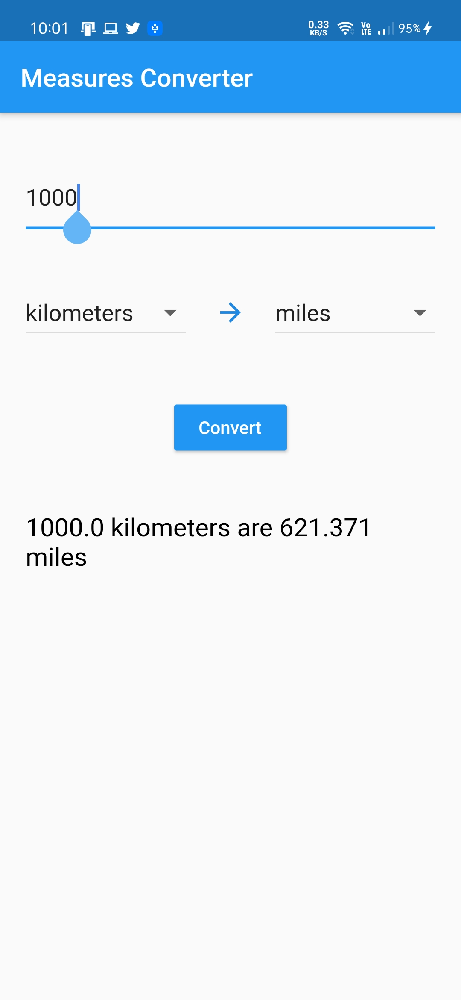

# Measure Converter  ⚖️
The measures conversion app will allow your users to select a measure – metric or imperial
– and convert it to another measure.

## Screenshots

<p float="left">



</p>

# Command To Install

### Install dependencies

```sh
flutter pub get
```

### Run application

```sh
flutter emulators --launch <emulator_name>
flutter run
```
## Author

👨‍💻 **Abdul Azim**

* Github: [Abdul Azim](https://github.com/azim2429)
* Medium: [Unit Converter](https://abdulazim0402.medium.com/how-i-created-my-first-flutter-project-a-measurement-converter-app-805726c3725a)

## Show your support

Give a ⭐️ if this project helped you!
